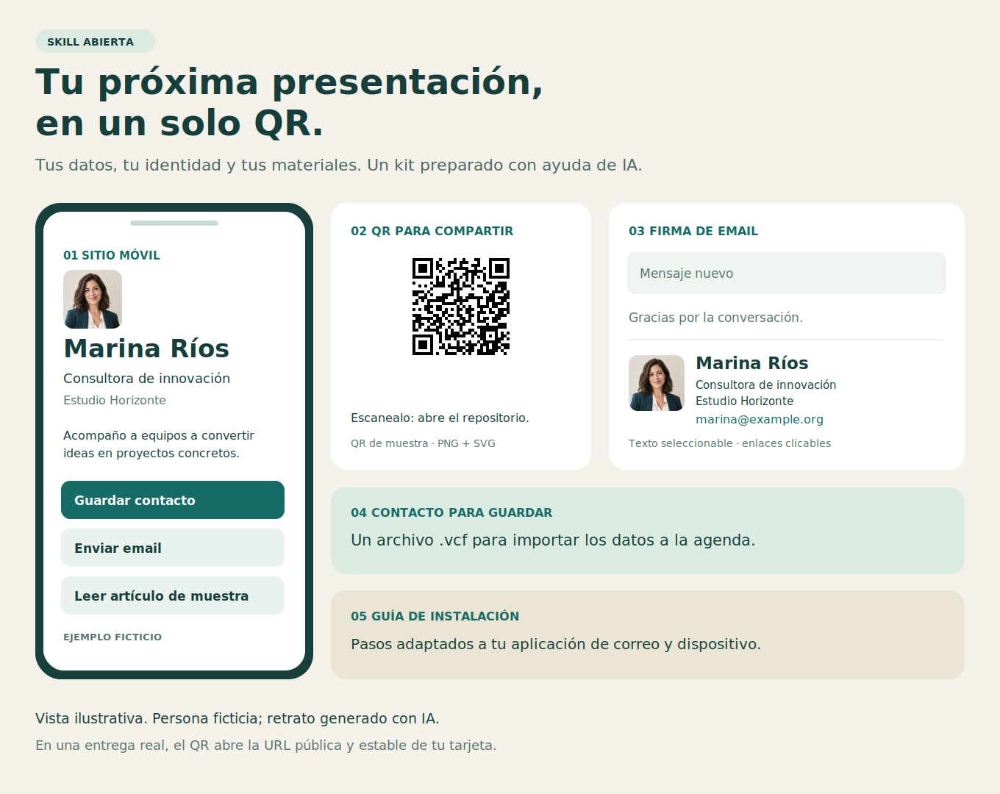
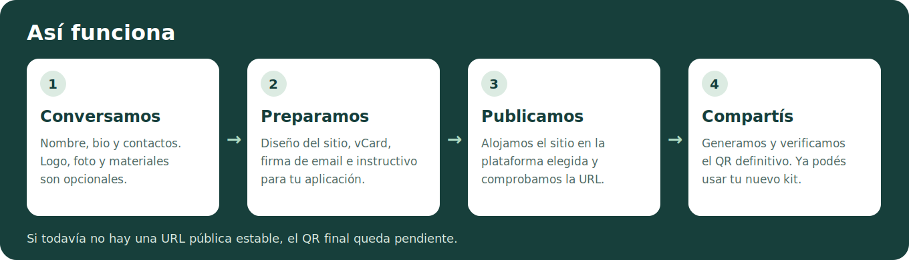

# Tarjeta digital, QR y firma de email

**Presentate con un QR. Compartí tu contacto, tus enlaces y tus materiales desde un mismo lugar.**

Este proyecto es una **skill abierta para asistentes de IA**: una carpeta de instrucciones, referencias y herramientas que le enseña al asistente a preparar tu kit de contacto. Te hace preguntas de a una, organiza lo que compartís y lo convierte en entregables con tu identidad visual.

[Ver el ejemplo](#un-ejemplo-concreto) · [Empezar](#cómo-empezar) · [Proponer mejoras](CONTRIBUTING.md)



*Marina Ríos y Estudio Horizonte son ficticios; el retrato fue generado con IA. El QR de esta imagen abre este repositorio. En una entrega real, el QR abre tu tarjeta publicada.*

## ¿Qué problema resuelve?

Después de una reunión, una charla o un evento, suele haber varios datos para compartir: teléfono, email, LinkedIn, web y algún material. Esta skill ayuda a reunirlos en un sitio pensado para el celular. Quien escanea tu QR puede ver lo que hacés, abrir tus enlaces y guardar tu contacto.

La firma de email completa el kit para que puedas presentarte también desde tus correos.

## ¿Qué recibís?

| Entregable | Para qué sirve |
| --- | --- |
| **Sitio móvil** | Mostrar nombre, actividad, bio, logo o foto, enlaces y materiales. |
| **QR en PNG y SVG** | Abrir el sitio al escanearlo; usarlo en pantalla o en piezas impresas. |
| **Contacto `.vcf`** | Importar los datos a la agenda mediante «Guardar contacto». |
| **Firma HTML y texto plano** | Pegar una firma con texto seleccionable y enlaces en tu correo. |
| **Instructivo de instalación** | Seguir los pasos para tu aplicación de correo y dispositivo. |

## Así funciona



1. **Conversamos.** El asistente pide los datos de a uno y aprovecha los que ya aportaste.
2. **Preparamos.** Organiza el contenido y diseña el sitio, la vCard y la firma.
3. **Publicamos.** Se usa la plataforma elegida y se comprueba la dirección del sitio.
4. **Compartís.** Con la URL estable se genera y verifica el QR final.

La skill guía el trabajo del asistente. El script de Python genera la vCard, la firma y el QR; la construcción y publicación del sitio requieren las herramientas y permisos disponibles en el entorno.

## Un ejemplo concreto

Marina es una consultora ficticia que quiere compartir su presentación después de un encuentro. Usa Gmail en Chrome sobre Windows y prefiere una tarjeta sobria, con un retrato generado con IA como foto de ejemplo.

> Usá esta skill para crear mi tarjeta digital. Soy Marina Ríos, consultora de innovación en Estudio Horizonte. Mi correo de ejemplo es marina@example.org. Quiero una bio breve, un artículo para leer y una firma para Gmail en Chrome sobre Windows. Usá verde oscuro y fondo claro. Preguntame de a un dato lo que falte.

**Probá los archivos de muestra:** descargá el repositorio con **Code → Download ZIP**, descomprimilo y abrí `examples/demo/index.html` en tu navegador. Desde ahí podés abrir la tarjeta, ver la firma y descargar el contacto ficticio. Los HTML se abren localmente; GitHub muestra su código, no una página web publicada.

| Ejemplo incluido | Archivo |
| --- | --- |
| Tarjeta móvil | [`examples/demo/tarjeta.html`](examples/demo/tarjeta.html) |
| Firma renderizable | [`examples/demo/firma-email.html`](examples/demo/firma-email.html) |
| Firma de texto | [`examples/demo/firma-email.txt`](examples/demo/firma-email.txt) |
| Contacto ficticio | [`examples/demo/contacto.vcf`](examples/demo/contacto.vcf) |
| Instalación de la firma de muestra | [`examples/demo/Instalar-firma-Gmail.html`](examples/demo/Instalar-firma-Gmail.html) |
| QR que abre este repositorio | [PNG](docs/images/qr-del-repositorio.png) · [SVG](docs/images/qr-del-repositorio.svg) |

### Otros casos de uso

| Persona o equipo | Qué podría incluir |
| --- | --- |
| **Consultor o profesional independiente** | Presentación, WhatsApp, LinkedIn, servicios y contacto descargable. |
| **Autor o docente** | Bio, artículo o PDF autorizado, enlace para comprar un libro y firma de correo. |
| **Equipo comercial** | Identidad de marca compartida y una tarjeta, vCard y QR por integrante. |

Un enlace para comprar un libro, una página para leer un artículo y un archivo descargable se presentan como acciones distintas. Se publican únicamente los materiales destinados a distribución.

## ¿Qué datos necesitás?

Empezá por el **nombre que querés mostrar**. Podés sumar actividad, organización, mini bio, email, WhatsApp con código de país, LinkedIn y web. Logo, foto, otros enlaces y materiales son opcionales: podés decir «saltear» o «usá tu criterio».

Para la firma, indicá **servicio de correo + aplicación + dispositivo**. Por ejemplo, «Gmail, Chrome, Windows» o «Microsoft 365, Outlook nuevo, Windows». El asistente comprueba las instrucciones oficiales antes de preparar la guía de una entrega real.

## Cómo empezar

### Con un asistente de IA

1. Descargá este repositorio desde **Code → Download ZIP**.
2. En un entorno que admita skills, usá su función de instalación o adjuntá el ZIP y pedí: «Instalá esta skill». Necesita acceso a los archivos de la carpeta completa, incluido `SKILL.md`.
3. Una vez instalada, pedí: **«Usá compartir-datos-personales-con-qr para crear mi tarjeta, QR y firma de email»**.

El entorno necesita poder leer archivos, ejecutar Python y disponer de herramientas para crear y alojar el sitio. Las opciones de instalación y publicación dependen del asistente utilizado. El proyecto se distribuye bajo licencia MIT; cada persona aporta sus propias herramientas de IA y hosting.

### Generar archivos con Python

Requiere Python 3.10 o superior. Desde la carpeta del repositorio:

```bash
python -m pip install -r requirements.txt
python -c "from pathlib import Path; Path('perfil.json').write_bytes(Path('references/profile.example.json').read_bytes())"
```

Editá `perfil.json` con tus datos. **Reemplazá los enlaces ficticios y quitá `public_url` mientras no tengas la URL real del sitio.** Después ejecutá:

```bash
python scripts/build_assets.py --profile perfil.json --output entrega-v1
```

- Con una `public_url` HTTPS genera vCard, firmas y QR PNG/SVG.
- Sin `public_url` genera vCard y firmas; deja el QR pendiente.
- El generador valida el formato de la URL, pero no comprueba que el sitio esté publicado. Esa comprobación y la lectura del QR forman parte del flujo de la skill.
- El script no crea ni publica la página y no instala la firma en una cuenta.

El archivo `perfil.json` y las entregas están excluidos por `.gitignore`. Mantené los perfiles reales, las credenciales y los materiales de clientes fuera de este repositorio público. El ejemplo incluido es ficticio y está identificado como tal.

## Para quienes quieran mejorar el proyecto

| Dónde mirar | Qué contiene |
| --- | --- |
| [`SKILL.md`](SKILL.md) | El flujo completo que sigue el asistente. |
| [`references/intake.md`](references/intake.md) | La entrevista para recopilar los datos. |
| [`references/email-install.md`](references/email-install.md) | Criterios y fuentes para los instructivos de correo. |
| [`references/profile.example.json`](references/profile.example.json) | El formato del perfil de entrada. |
| [`scripts/build_assets.py`](scripts/build_assets.py) | El generador de archivos. |
| [`tests/test_assets.py`](tests/test_assets.py) | Pruebas del generador. |
| [`examples/demo/`](examples/demo/) | Un ejemplo descargable con datos ficticios. |

Para reportar un problema, abrí un **Issue**. Para proponer una mejora, enviá un **Pull Request**. En [`CONTRIBUTING.md`](CONTRIBUTING.md) están los pasos y las pruebas. Son bienvenidas mejoras de accesibilidad, nuevas guías de correo, traducciones y ejemplos.

**Autor: Leandro E. Mocchegiani · Licencia [MIT](LICENSE).**
